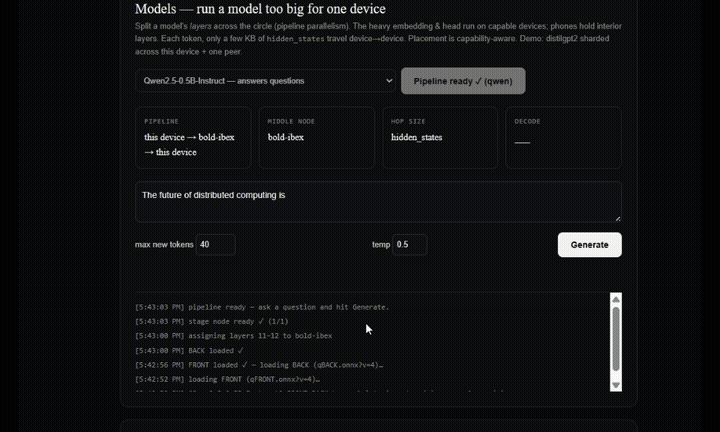

# Osiris Compute

[](LICENSE)
[](https://compute.osirisindustries.net)
[-success)](package.json)
[](CONTRIBUTING.md)

**A browser-based, peer-to-peer public compute utility. No install. No cryptocurrency. No data center.**

Osiris Compute lets people pool the spare compute of their own devices and trusted peers into a **private circle** — straight from the browser. It is a modern, web-era successor to volunteer-computing projects like BOINC and SETI@home, built for one stubborn belief: **useful computation should not have to live inside a hyperscaler's data center.**

▶ **Try the live grid:** **https://compute.osirisindustries.net** (desktop Chrome/Edge, open it in two tabs)  ·  Source: **https://github.com/osiris-industries/osiris-compute**

<!-- DEMO: drop a short screen-recording GIF here once captured, e.g.

A ~20s clip of two tabs (or a phone + laptop on one wifi) streaming tokens is the
single highest-impact thing to add to this README. -->

---

## Why this exists

Compute has quietly re-centralized. Training and inference, the work that increasingly matters, happens on a handful of corporate clouds behind capacity gates and credit cards. Meanwhile billions of capable devices — laptops, desktops, phones — sit idle most of the day.

Osiris Compute is a small bet that you can put that idle capacity to work **without** an account, an installer, a token, or a wallet — and without a server ever seeing your data. You open a tab, you share a link with people you trust, and the browsers do the rest.

It is deliberately a **free public utility, not a product.** Fork it, host it, federate it.

---

## How it works

1. **Open a circle.** One device hosts and gets a single share link.
2. **Peers join from the browser.** No install — just the link.
3. **The coordination server only introduces, then withdraws.** It performs WebRTC signaling (SDP/ICE exchange) and roster/capability discovery, then steps out of the data path.
4. **Work flows directly peer-to-peer** over WebRTC data channels. Tasks execute inside a **WebAssembly + WebGPU sandbox**, isolated from files, photos, passwords, and the local network.
5. **Participation is conscious.** Computation runs only while the tab is open and visible — no hidden background work, no surprise battery drain.

The server never sees your data, because after the introduction it isn't in the conversation.

### Distributed LLM inference (the headline capability)

Osiris Compute can run a language model **too big for any single device** by splitting its layers across the circle (pipeline parallelism):

- The heavy **embedding + head** run on capable "anchor" devices (a laptop/desktop).
- The **interior transformer layers** are sliced into shards that phones can each hold.
- Each generated token, only a few **kilobytes of hidden-state** travel device → device — not the weights.
- Placement is capability-aware: strong devices anchor, weak devices hold a slice.

The live grid currently serves several models this way — from Qwen2.5-0.5B up to **Mistral-7B-Instruct split across a host + 6 interior shards**, with coherent generation across machines that could never each hold the whole model.

> **Status note:** the larger **Mistral-7B** distributed implementation is **under active testing** right now — multi-shard pipelines at that size are still being hardened, so expect rough edges on that specific model. The smaller models (Qwen2.5-0.5B / 1.5B, distilgpt2) are the stable, reliable demos.

---

## Run it on a LAN — the fast path ⚡

If everyone is **on the same network** (a house, an office, a dorm, one router), Osiris Compute gets dramatically faster — close to how distributed inference behaves inside a data center. Here's the physics, because it's the whole point:

In pipeline-parallel decoding, the only thing that crosses the network per token is the **hidden state** — about `hidden_dim × 2 bytes` (≈ **8 KB** for a 7B model). That's tiny, so you are **never bandwidth-bound.** What you actually pay is **one network round-trip per hop**, and since each token depends on the last, those hops happen **in series**:

```
per-token time  ≈  Σ(stage compute)  +  (number of hops) × round-trip-latency
```

The compute term is fixed by your devices. The *only* term that changes between "friends across the internet" and "friends in the same room" is the round-trip latency — multiplied by ~7–8 hops. So it dominates everything:

| network | RTT / hop | network cost / token (7 hops) | regime |
|---|---|---|---|
| Open internet (WAN) | ~40 ms | **~280 ms** | latency-bound, sluggish |
| Wi-Fi LAN | ~3–8 ms | ~20–55 ms | network now a minority of the budget |
| Wired gigabit LAN | ~0.4 ms | **~3 ms** | **compute-bound — network effectively gone** |

That last row *is* the data-center condition. A data-center pipeline isn't magic; its interconnect (NVLink / InfiniBand) just has negligible latency relative to compute. A gigabit LAN is the consumer-grade version of the same fabric — a **10–100× cut in round-trip time vs the open internet**, which is exactly the term that was hurting. On a LAN, WebRTC also connects peers **directly** over host candidates (no TURN relay, no internet round-trip at all), and your data never leaves the network — so it's **fast _and_ fully private/local.**

There's a second-order win, too: on a WAN you want to **minimize hops** (fewer, beefier devices). On a LAN hops are nearly free, so you can split **deeper** across **more modest devices** (more phones, smaller shards each) and run a **bigger** model than any single one of them could hold.

**Important — serve HTTPS on a LAN.** Browsers only expose **WebGPU in a "secure
context."** `localhost` qualifies even over http, but a plain-http **LAN IP**
(`http://192.168.x.x`) does **not** — so devices joining a LAN host over http can
connect, but have **no WebGPU and cannot run inference.** The fix is to serve
`https` (a self-signed cert is fine); then the LAN IP becomes a secure context and
WebGPU works on every device.

```bash
# one-time: make a self-signed cert for this host
openssl req -x509 -newkey rsa:2048 -nodes -days 365 \
  -keyout key.pem -out cert.pem -subj "/CN=osiris-lan"

# serve https+wss on all interfaces, with a demo model pre-loaded
./fetch-demo-model.sh
HOST=0.0.0.0 TLS_CERT=cert.pem TLS_KEY=key.pem node server.js   # -> https on :8443

# everyone on the same network opens:  https://<this-machine-LAN-ip>:8443
# (accept the self-signed warning once per device — that's expected)
```

Pre-fetching the shards onto the host means peers pull them over the local network (fast), and nothing about the model or your prompts ever touches the internet. **A LAN party of friends pooling their phones to run a 7B together is the sweet spot for this project.**

> No-TLS fallbacks: each device can instead whitelist the origin via
> `chrome://flags/#unsafely-treat-insecure-origin-as-secure` (manual, per device),
> or run http and accept that joiners fall back to the slower WASM-CPU path where
> WebGPU is unavailable. HTTPS is the clean option.

---

## For reviewers (DigitalOcean Open Source team 👋)

The fastest way to see it work — **no clone, no install:**

1. Open **https://compute.osirisindustries.net** in **desktop Chrome or Edge** (WebGPU is required; Safari/Firefox and most mobile browsers won't run the inference path yet).
2. Open the **same link in a second tab** (or on a second device) — that forms a two-peer circle. The signaling server even hands out a TURN relay, so peers on different networks can connect.
3. Pick a model and run it. **Start with `Qwen2.5-0.5B` or `distilgpt2`** — they're small, so the shards load in seconds and you'll see tokens stream across the circle almost immediately. Larger models download more weight to the browser first, so give them a moment.

A few honest expectations:
- **WebGPU + Chrome/Edge desktop** is the supported path for the anchor device.
- **First model load downloads its shards** to the browser, so there's a brief wait before the first token (smaller model = faster).
- **Latency over the public internet is the cost center** (see [Run it on a LAN](#run-it-on-a-lan--the-fast-path-)) — on a shared local network it gets *much* faster, approaching data-center behavior. That's the headline use case for the self-host release.
- **Mistral-7B is mid-testing** (see the status note above) — for a clean first impression, use a small model.

Happy to give a live walkthrough across a couple of your own devices — just reach out to **admin@osirisindustries.net**.

---

## Quickstart

```bash
npm install                 # one dep: ws (see package.json); server uses node's built-in http
node server.js              # signaling router + static host on http://127.0.0.1:8080
# open http://localhost:8080 in two browser tabs to form a circle
```

That gets you the running signaling server and the full circle UI. To form a circle
across **two separate devices** on your LAN, bind to all interfaces (and see the
[Run it on a LAN](#run-it-on-a-lan--the-fast-path-) section for why that's the fast path):

```bash
HOST=0.0.0.0 node server.js
# then open http://<your-lan-ip>:8080 on the other device
```

### Try a real distributed model

A fresh clone has the framework but **no model shards** (they are large binaries,
not stored in git). There are three ways to actually run a model:

1. **Just try the live grid** — open <https://compute.osirisindustries.net> on two
   devices and pick a model. Zero setup; this is the real public grid.
2. **Fetch a demo model into your own server** — pull a small model's shards
   (Qwen2.5-0.5B, ~1.3GB) from the public grid into `public/models/`:
   ```bash
   ./fetch-demo-model.sh        # downloads the 'qwen' shards
   node server.js               # the 'qwen' model now loads locally
   ```
3. **Build your own** from any HuggingFace model with the partitioning toolchain in
   [`tools/`](tools/) (export → int4-quant → seam-aware slice → serve). See
   [tools/README.md](tools/README.md).

### Configuration (environment variables)

| var | purpose | default |
|---|---|---|
| `PORT` | port the signaling + static server listens on | `8080` |
| `HOST` | interface to bind | `127.0.0.1` (set `0.0.0.0` for other devices on your network) |
| `TLS_CERT` / `TLS_KEY` | paths to a cert+key to serve **https + wss** (required for WebGPU on a LAN, see above) | — (http if unset; port defaults to 8443 when set) |
| `TURN_SECRET` | shared secret for time-limited TURN credentials (HMAC-SHA1) | — (TURN off if unset) |
| `TURN_HOST` / `TURN_PORT` | your coturn relay, for peers behind symmetric NATs | — / `3478` |

STUN uses public `stun.l.google.com:19302` out of the box. TURN is **optional** — only needed so peers on hostile NATs can still connect; supply your own relay. No secrets are committed to this repo.

---

## Repository layout

```
server.js            signaling router (WebRTC SDP/ICE relay, roster, ICE-config endpoint) + static host
public/index.html    the client — WebRTC mesh, WASM/WebGPU sandbox, model registry, shard chaining
public/wabt.js       vendored WebAssembly Binary Toolkit (Apache-2.0; see NOTICE)
fetch-demo-model.sh  pull a small demo model's shards from the public grid into public/models/
tools/               model partitioning toolchain (HF model → browser-ready FRONT/interior/BACK shards)
tools/configs/       example model configs (qwen, mistral7b, llama3b, gemma2-2b, …)
```

Model **shards** (the `.onnx` files) are large and served as static assets
out-of-band — they live under `public/models/<id>/` at runtime but are **not** stored
in git (see `.gitignore`). Use `fetch-demo-model.sh` to grab one, or build your own
with the toolchain in `tools/`.

---

## Contributing & security

Contributions of every size are welcome — see [CONTRIBUTING.md](CONTRIBUTING.md).
Found a security issue? Please report it privately per [SECURITY.md](SECURITY.md).
Everyone participating is expected to follow the [Code of Conduct](CODE_OF_CONDUCT.md).

---

## License

**GNU Affero General Public License v3.0** (see [LICENSE](LICENSE)). If you run a modified version as a network service, the AGPL asks you to share your changes — fitting for a utility meant to stay public. Third-party components are listed in [NOTICE](NOTICE).

A project of **Osiris Industries** — admin@osirisindustries.net
